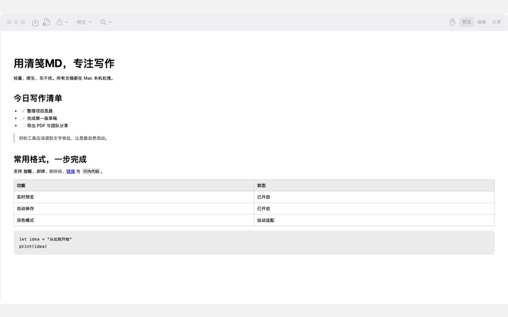
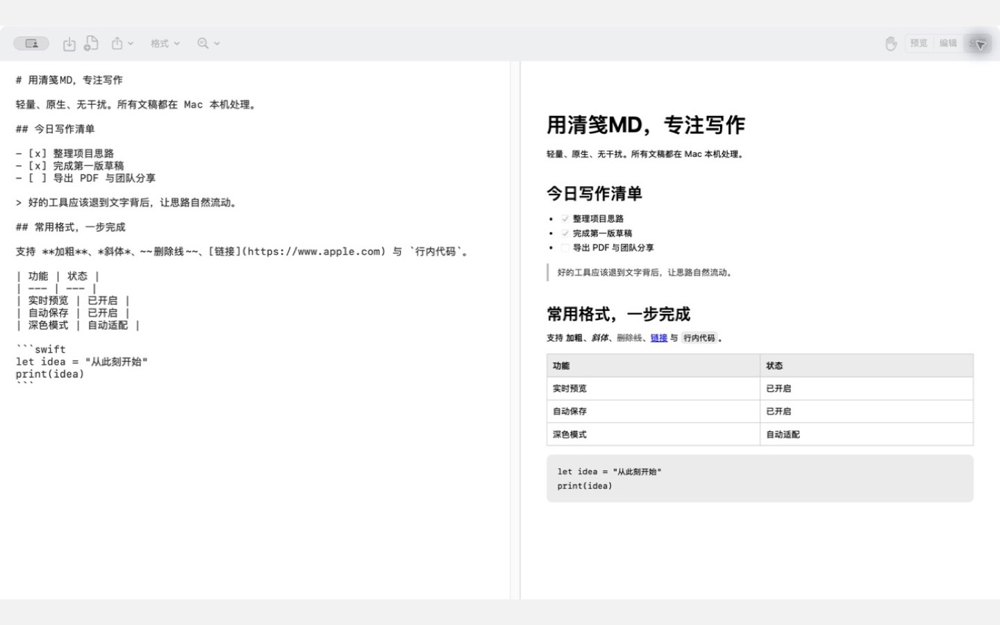
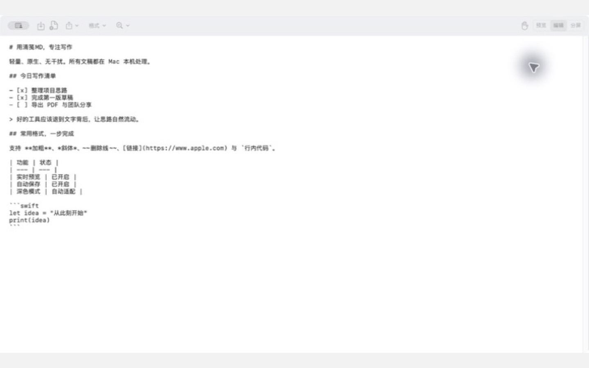

  

<h1 align="center">清笺MD</h1>

轻量、原生、专注写作的 macOS Markdown 编辑器。

清笺MD 支持直接打开 `.md` 和 `.markdown` 文件，在预览、编辑与分屏模式之间快速切换。文稿默认在 Mac 本地处理，不要求登录，也不上传文稿内容。

> 当前发布的是公开测试版。安装包尚未使用 Apple Developer ID 签名和公证，首次打开需要在 macOS“隐私与安全性”中手动允许。请先阅读[安装说明](docs/INSTALL.md)。

## 界面预览

### 实时预览

### 分屏编辑

### 专注编辑

## 主要功能

- 预览、编辑、分屏三种视图
- Markdown 实时预览与分屏滚动联动
- 标题、强调、列表、任务清单、引用、代码、链接、图片、表格和脚注
- 选择文字后显示浮动快捷格式条
- 五种常用快捷颜色与自定义颜色
- 查找、替换、结果计数与定位
- 自动保存、另存为、最近文件和多标签页
- 导出 PDF 和 DOCX
- 深色与浅色外观自动适配
- 常用 macOS 键盘快捷键
- Apple 芯片与 Intel Mac 通用安装包

## 下载

前往 [Releases](https://github.com/lproc2006/qingjian-md/releases/latest) 下载最新的 macOS 通用安装包。

系统要求：macOS 14.0 或更高版本。

## 快速开始

1. 下载并解压 `QingjianMD-*-macOS-universal.zip`。
2. 将“清笺MD”拖入“应用程序”文件夹。
3. 首次打开时，按照[安装说明](docs/INSTALL.md)在“隐私与安全性”中允许打开。
4. 双击 Markdown 文件，或在应用中选择“文件 > 打开”。
5. 如需设为默认应用，请在 Finder 中选中文件，打开“显示简介”，在“打开方式”中选择“清笺MD”，再点按“全部更改”。

详细操作请阅读[使用指南](docs/USER_GUIDE.md)和[快捷键](docs/SHORTCUTS.md)。

## 隐私

清笺MD 不收集、上传或出售文稿内容和个人信息。文稿引用网络图片时，预览可能向图片所在服务器发起连接；点击链接时会交给默认浏览器打开。详情见[隐私说明](docs/PRIVACY.md)。

## 反馈

- 遇到问题：[提交问题](https://github.com/lproc2006/qingjian-md/issues/new?template=bug_report.yml)
- 功能建议：[提交建议](https://github.com/lproc2006/qingjian-md/issues/new?template=feature_request.yml)

提交问题时，请附上 macOS 版本、清笺MD版本、复现步骤和截图。请勿上传包含隐私内容的文稿。

## 发布说明

查看 [CHANGELOG.md](CHANGELOG.md)。

## 许可

本仓库用于发布清笺MD安装包与使用文档，当前未开放应用源代码。除非另有明确说明，清笺MD及其图标、安装包和文档保留所有权利。
