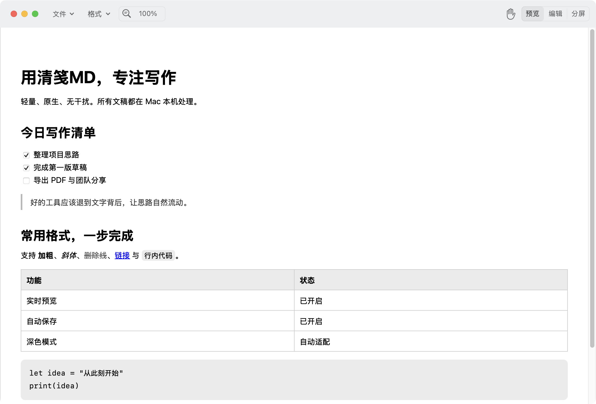
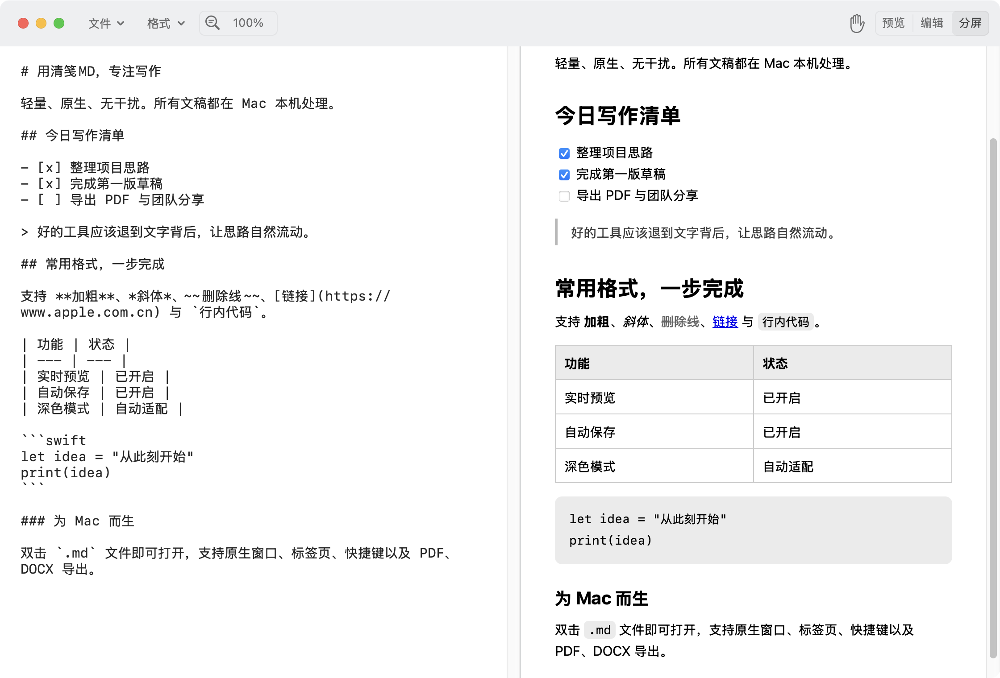
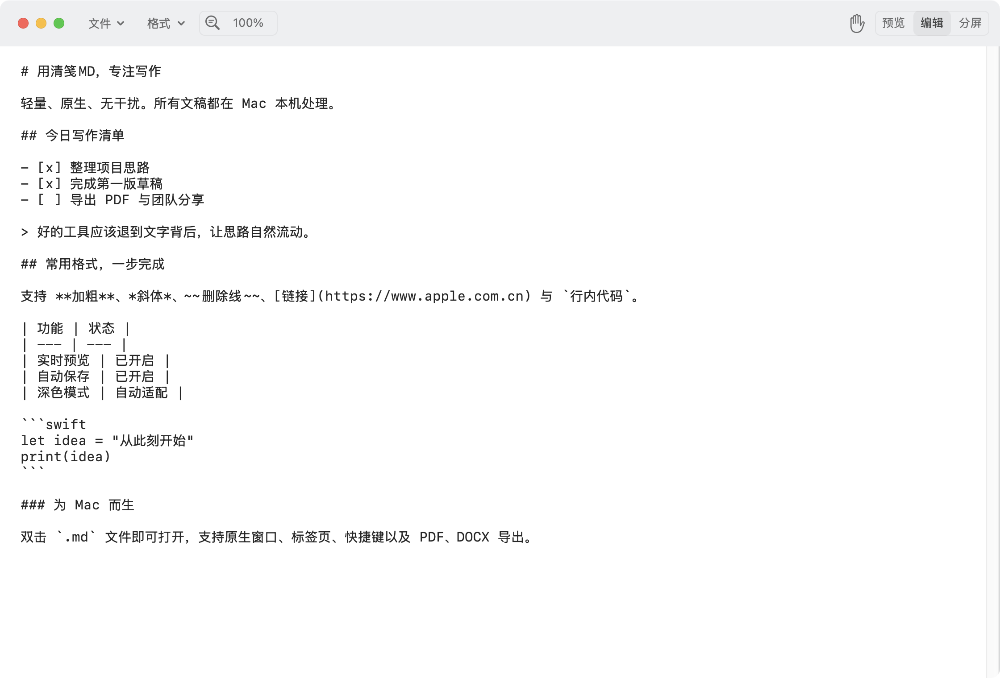

  

<h1 align="center">清笺MD</h1>

<strong>为 Mac 而生的原生 MD 编辑器</strong>

双击即开 · 实时分屏 · 自动保存 · PDF / DOCX 导出

清笺MD 是一款 **macOS 专用** Markdown 编辑器。它没有浏览器套壳的繁重感，也不要求把文稿导入专用资料库：Finder 中双击 `.md` 文件即可打开，修改后继续保存在原位置。

界面、窗口、标签页、菜单和快捷键均遵循 Mac 使用习惯。在预览、编辑与分屏之间一键切换，适合快速查看 Markdown，也适合安静地完成一篇长文。

> 当前发布的是公开测试版。安装包尚未使用 Apple Developer ID 签名和公证，首次打开需要在 macOS“隐私与安全性”中手动允许。请先阅读[安装说明](docs/INSTALL.md)。

## 界面预览

### 实时预览

### 分屏编辑

### 专注编辑

## 为什么选择清笺MD

### 真正适合 Mac 的打开方式

不用导入、不用登录、不改变原有文件结构。可设为 `.md` 和 `.markdown` 的默认应用，在 Finder 中双击即开；窗口拖动、全屏、多标签页、最近文件和自动保存都采用 macOS 原生体验。

### 像 Obsidian 一样边写边看

预览、编辑、分屏三种模式一键切换。分屏时左侧写 Markdown，右侧即时显示最终效果；两侧可以分别滚动，并保持一致的文字显示比例。

### 写作需要的格式，一处就够

内置标题、加粗、斜体、删除线、列表、任务清单、引用、代码、链接、图片、表格和脚注。选择文字后，快捷格式条会贴近选区出现，并可自由拖动；五种常用颜色后提供一键取消颜色，连续修改同类格式时会自动替换旧格式。

### 从 Markdown 直接交付成品

除了保留原始 Markdown，还能导出 PDF 和 DOCX，方便打印、分享，或交给 Word、WPS 继续编辑。

### 文稿留在自己的 Mac

无需账号，没有广告，不上传文稿内容。支持系统深色与浅色外观自动切换，Apple 芯片与 Intel Mac 均可运行。

## 功能一览

- Markdown 实时预览与分屏双侧独立滚动
- 完整常用格式与五种精选快捷颜色
- 文件操作集中在原生“文件”下拉菜单
- 比例预设、滑杆与加减按钮组合缩放
- 预览模式直接勾选任务清单
- 查找、替换、搜索数量和结果定位
- 自动保存、另存为、最近文件与多标签页
- PDF、DOCX 导出
- macOS 原生菜单、窗口和键盘快捷键
- Apple 芯片与 Intel Mac 通用安装包

## 下载

前往 [Releases](https://github.com/lproc2006/qingjian-md/releases) 下载最新的 macOS 通用安装包。

系统要求：macOS 14.0 或更高版本。

## 快速开始

1. 下载并解压 `QingjianMD-*-macOS-universal.zip`。
2. 将“清笺MD”拖入“应用程序”文件夹。
3. 首次打开时，按照[安装说明](docs/INSTALL.md)在“隐私与安全性”中允许打开。
4. 双击 Markdown 文件，或在应用中选择“文件 > 打开”。
5. 如需设为默认应用，请在 Finder 中选中文件，打开“显示简介”，在“打开方式”中选择“清笺MD”，再点按“全部更改”。

详细操作请阅读[使用指南](docs/USER_GUIDE.md)和[快捷键](docs/SHORTCUTS.md)。

## 隐私

清笺MD 不收集、上传或出售文稿内容和个人信息。文稿引用网络图片时，预览可能向图片所在服务器发起连接；点击链接时会交给默认浏览器打开。详情见[隐私说明](docs/PRIVACY.md)。

## 反馈

- 遇到问题：[提交问题](https://github.com/lproc2006/qingjian-md/issues/new?template=bug_report.yml)
- 功能建议：[提交建议](https://github.com/lproc2006/qingjian-md/issues/new?template=feature_request.yml)

提交问题时，请附上 macOS 版本、清笺MD版本、复现步骤和截图。请勿上传包含隐私内容的文稿。

## 发布说明

查看 [CHANGELOG.md](CHANGELOG.md)。

## 许可

本仓库用于发布清笺MD安装包与使用文档，当前未开放应用源代码。除非另有明确说明，清笺MD及其图标、安装包和文档保留所有权利。
