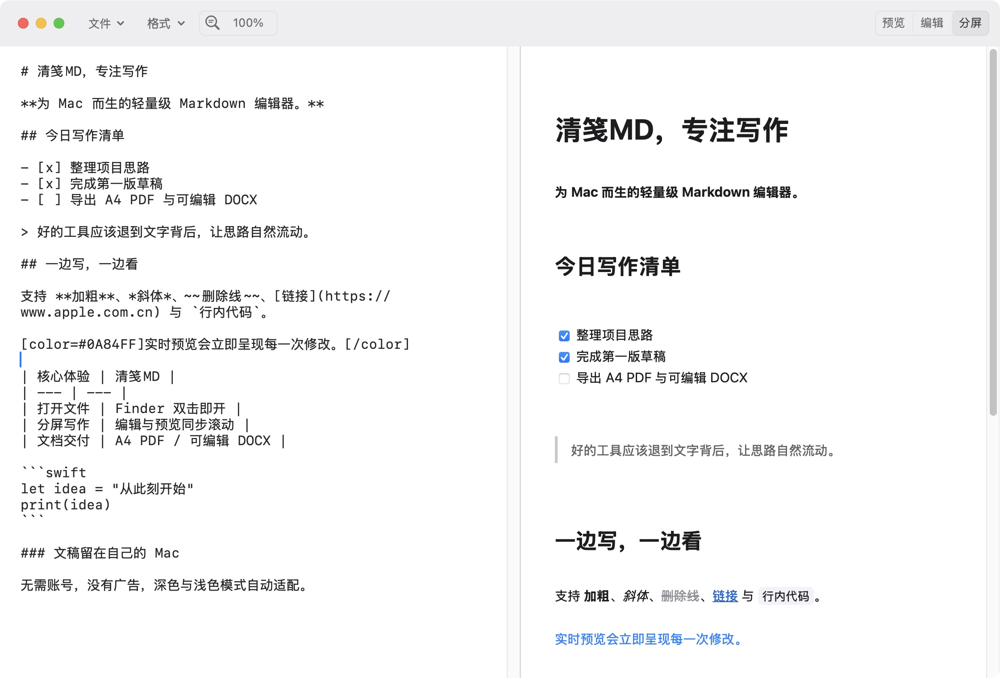
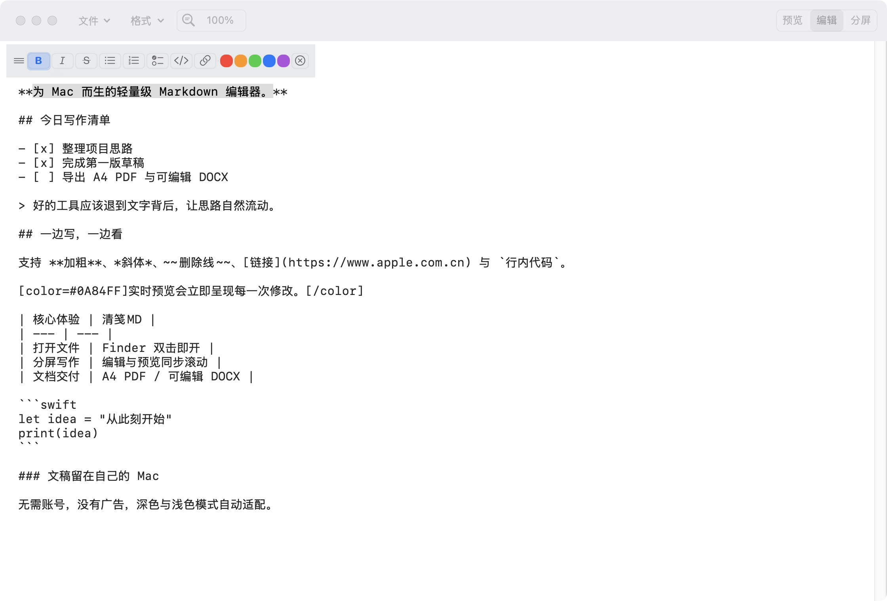
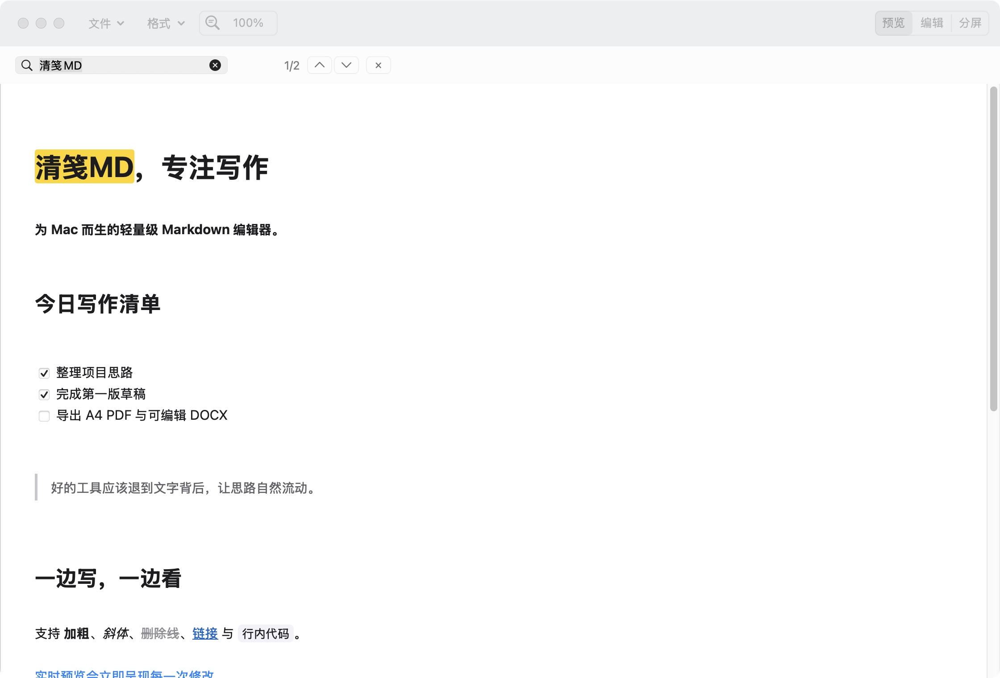

  

<h1 align="center">清笺MD</h1>

<strong>为 Mac 而生的轻量级 Markdown 编辑器</strong>

Finder 双击即开 · 原生多标签页 · 实时分屏 · 自动保存 · A4 PDF / DOCX

  <a href="https://github.com/lproc2006/qingjian-md/releases/tag/v1.0.0-beta.4"><strong>下载最新版</strong></a>
  ·
  <a href="docs/INSTALL.md">安装说明</a>
  ·
  <a href="docs/USER_GUIDE.md">使用指南</a>

清笺MD 是一款 **macOS 专用** Markdown 编辑器。它不要求建立资料库，也不会改变原有文件结构：在 Finder 中双击 `.md` 或 `.markdown` 文件即可打开，编辑后继续保存到原位置。

应用使用原生 macOS 窗口、标签页、菜单和快捷键。预览、编辑与分屏三种模式一键切换，适合快速阅读 Markdown、持续写作，也适合把内容交付为规范的 PDF 或可编辑 DOCX。

## 最新版亮点

### 打开文件，直接进入合适的状态

- 新建文稿或空白文件默认进入**编辑模式**，可以立即输入。
- 已有内容的文稿默认进入**预览模式**，双击后先看到最终排版。
- 可将清笺MD设为 `.md` 与 `.markdown` 文件的默认打开应用。

### 分屏不只是并排显示

左侧编辑 Markdown，右侧即时呈现最终结果。无论滚动编辑区还是预览区，另一侧都会按当前正文段落同步定位，确保两边当前显示的内容始终对应；两侧共用显示比例和基准字号，长文对照更自然。编辑中的回车次数和连续空行也会在预览中原样保留。

### 格式操作集中、顺手

窗口工具栏中的“格式”菜单覆盖标题、粗体、斜体、删除线、无序列表、有序列表、任务清单、引用、行内代码、代码块、链接、图片、表格、分隔线和脚注。

选择文字后，快捷格式条会贴近选区出现，并可自由拖动。它提供常用格式、红橙绿蓝紫五种颜色和一键取消颜色；连续应用同类格式时，会用最后一次操作替换之前的同类格式。

### 预览模式也能搜索和完成待办

预览状态下按 `⌘F` 即可搜索全文，搜索框显示当前结果和总数量，并将第一个匹配结果标黄。编辑状态开始搜索时会自动隐藏选区快捷格式条，避免遮挡搜索结果。任务清单无需返回编辑模式，直接点击复选框即可完成或取消待办，并同步更新 Markdown 原文。

### Markdown 直接交付

- **PDF**：A4 页面、自动分页，打开后默认以 100% 比例显示。
- **DOCX**：A4 页面，标题、正文、列表、表格、链接、颜色和代码块均为可继续编辑的 Word 内容。
- **Markdown**：支持自动保存、保存、另存为、最近文件和原位置继续编辑。

## 三种工作模式

- **预览**：适合双击文件后快速阅读和检查最终样式。
- **编辑**：适合从空白文稿开始写作或集中修改原文。
- **分屏**：适合边写边看，编辑与预览即时同步。

## 为 Mac 做的细节

- Finder 双击打开 `.md` 与 `.markdown` 文件
- 原生窗口拖动、全屏、深色模式和浅色模式自动切换
- 多标签页编辑、最近文件、自动保存和另存为
- `⌘F` 查找，显示结果数量并高亮当前结果
- 编辑模式支持替换；预览模式支持文内搜索
- `⌘A`、`⌘C`、`⌘V`、`⌘X`、`⌘Z`、`⇧⌘Z` 等常用快捷键
- Markdown 链接交给 Mac 默认浏览器打开
- Apple 芯片与 Intel Mac 通用安装包
- 文稿默认只在本机处理，无需注册账号

## 工具栏

### 文件

“文件”下拉菜单集中提供新建、打开、保存、另存为、导出 PDF 和导出 DOCX。窗口顶部不再重复摆放多个文件按钮，常用操作更集中。

### 格式

“格式”下拉菜单提供完整常用 Markdown 操作。既可以先选择文字再套用格式，也可以先启用格式再输入内容。

### 缩放

显示比例面板提供常用比例、连续滑杆、加减按钮和百分比输入。预览、编辑、分屏共用一致的缩放逻辑，默认比例为 100%。

## 下载与安装

系统要求：**macOS 14.0 或更高版本**。

1. 前往 [Releases](https://github.com/lproc2006/qingjian-md/releases) 下载最新的 `QingjianMD-*-macOS-universal.zip`。
2. 解压后，将“清笺MD”拖入“应用程序”文件夹。
3. 首次打开时，按照[安装说明](docs/INSTALL.md)在“隐私与安全性”中允许打开。
4. 双击 Markdown 文件，或在清笺MD中选择“文件 > 打开”。

当前发布的是公开测试版，尚未使用 Apple Developer ID 签名和公证。请只从本仓库的 Releases 页面下载安装包，并使用同一发布页中的 `SHA256SUMS.txt` 核对文件。

## 设为默认 Markdown 应用

1. 在 Finder 中选中任意 `.md` 文件并打开“显示简介”。
2. 在“打开方式”中选择“清笺MD”。
3. 点按“全部更改”。

以后双击 Markdown 文件即可直接用清笺MD打开。

## 隐私

清笺MD不收集、上传或出售文稿内容和个人信息。文稿引用网络图片时，预览可能向图片所在服务器发起连接；点击链接时会交给默认浏览器打开。详情见[隐私说明](docs/PRIVACY.md)。

## 文档与反馈

- [使用指南](docs/USER_GUIDE.md)
- [快捷键说明](docs/SHORTCUTS.md)
- [版本记录](CHANGELOG.md)
- [提交问题](https://github.com/lproc2006/qingjian-md/issues/new?template=bug_report.yml)
- [提交建议](https://github.com/lproc2006/qingjian-md/issues/new?template=feature_request.yml)
- 联系邮箱：`lproc2019@gmail.com`

提交问题时，请附上 macOS 版本、清笺MD版本、复现步骤和截图。请勿上传包含隐私内容的文稿。

## 许可

本仓库用于发布清笺MD安装包与使用文档，当前未开放应用源代码。除非另有明确说明，清笺MD及其图标、安装包和文档保留所有权利。
